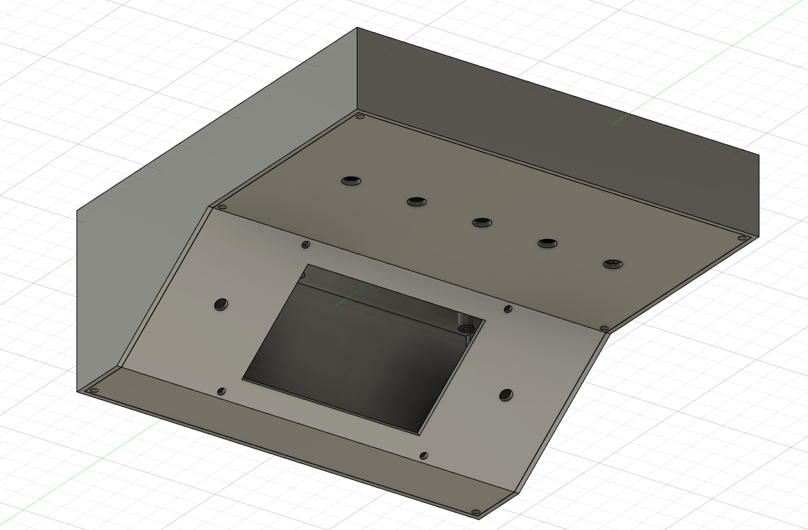
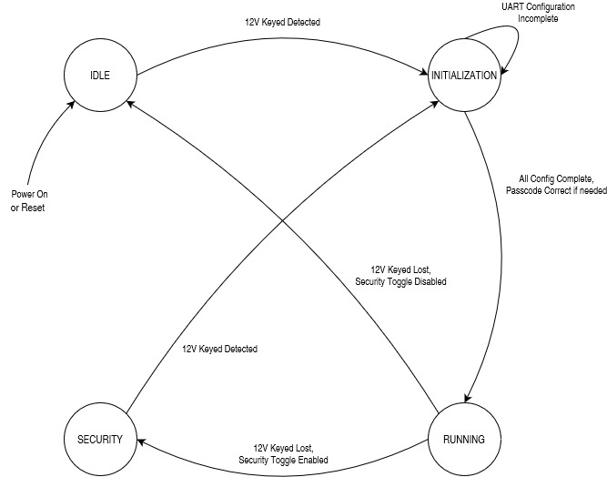
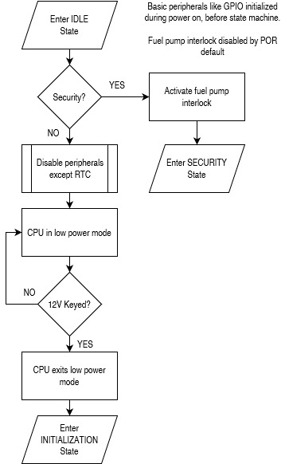
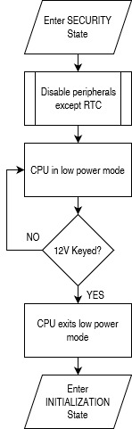
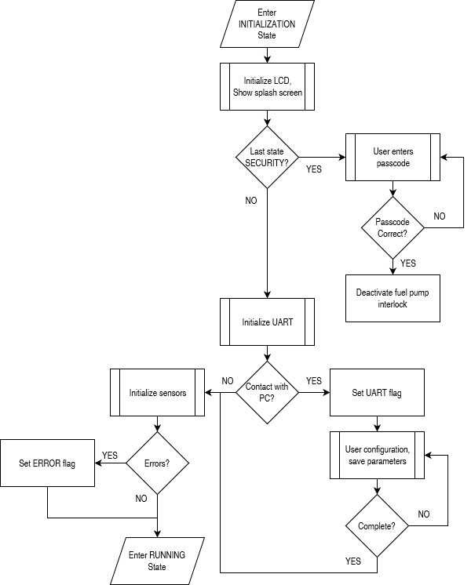
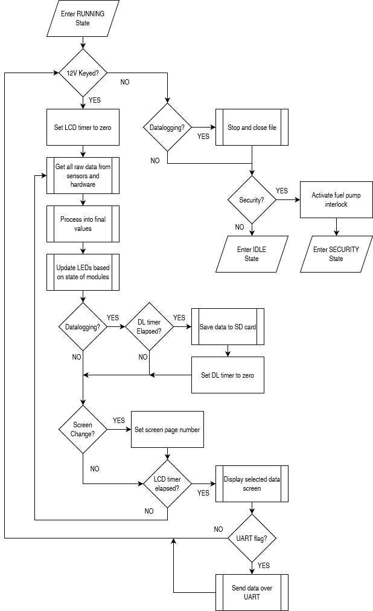

# XJ-Overhead-Console
Overhead Console Trip Computer for a 1990 Jeep Cherokee XJ. The goal is to display things like gyroscope readings and log GPS points.

The overhead console, or trip computer, should display the folling data by the time its fully complete:
- RTC time and date
- Temperature, pressure, humidity, both inside/outside
  - A remote mount sensor would be needed, with likely wireless radio communications
- Compass heading (cardinal and degrees)
- GPS latitude and longitude
- GPS speed (if accurate enough)
- GPS distance (calculated from sum of prior points or line-of-sight)
- Gyroscope roll and pitch
  - Gyroscope should be able to be zeroed
- Accelerometer readings that are above a threshold
  - Threshold should be settable
- System voltage
- The computer should know if the car is running or not
- The hardware circuit should provide a couple spare analog and digital IO for future use

The trip computer should be able to control the folling
- Off road lights (through relays)
  - User control of lights acheived through toggle switches
  - The ability to control off road lights gives the ability to alarm
- The horn (through a relay)
  - User control of horn acheived through pull cord mounted on side of head console
  - The ability to control the horn gives the ability to alarm
- A GSM module capable of sending SMS messages
  - This allows for GPS location in the event of a theft
  - Or possibly sending SOS messages to contacts in the event of an emergency
  - Or possibly remote kill switch capability

The trip computer should have the ability to connect to an SD card or USB flash drive:
- This allows for datalogging of all sensor data for later viewing
- Control of datalogging would be minimal. Auto generated file names.
  - User control of datalogging would be through a push button or toggle switch

A possible feature would be alarming. The alarm state could be acheived
through significant detection of motion, a GPS reading outside a geo-fence, or a combination
The addition of a PIR sensor inside the cab is possible, if experimentation shows it to not be too sensetive to activity outside the car.

# Overhead Console Project #

**1 Project Scope**

The scope of the project is to design a computer controller for a car that can provide security functionality, environmental data, locationing/positioning, and basic data logger functionality.

**1.1 Security Functionality**

The controller can provide security through the means of a fuel pump interlock system. Such a system involves interrupting power to the fuel pump when a security state is active, and returning signal to the fuel pump when the security state is inactive.

Additional security measures that may be implemented in the future are alarming (controlling lights and horn), the ability to send SMS text messages containing GPS location data, and PIR/glass-break sensors to be mounted inside the cabin. Security events may be recorded to the SD card.

**1.2 Environmental Data**

Environmental data that the computer is responsible for gathering, logging, and displaying includes temperature, atmospheric pressure, both inside and outside the cabin. A real time clock is also present that will track the time of all events and provide a readout. A low outside temperature should lead to an indication for the risk of ice on roadways.

**1.3 Locationing/Positioning Data**

The computer is also responsible for tracking location/position data. This includes GPS coordinates, gyroscope readings for pitch and roll, accelerometer readings, and compass heading. If the GPS is deemed accurate enough, GPS indicated speed and altitude should also be reported.

**1.4 Datalogging Functionality**

All normal operation data should be, optionally, recorded to an SD card by way of an SD card reader/writer. The controller will keep track of empty space on the SD card and auto-generate file names, but will not have the ability to browse or change existing files. The user will control data logging through a toggle switch.

**2 Project Requirements**

The project will have requirements for user interface, sensors, hardware, power supply, external communications (antennae, ports).

**2.1 User Interface**

The user interface will consist of a 20x4 character LCD, push buttons, toggle switches, LEDs, and a piezo buzzer. There should be 3 push buttons for menu navigation and special functions. There should be one toggle switch for security functionality and one toggle switch for controlling data-logging functions. There should be 3 LEDs for displaying the following conditions: GPS lock, SD card error, and general error. There will also be hardware reset and power switches available, though hidden from normal use.

**2.2 Sensors and Hardware, Controller**

The controller used for this project is the STM32F401RE. Discrete IO, I2C, SPI, and UART buses will be used to communicate with all modules and hardware. Time will be tracked by an RTC module that is built into the controller and powered via external coin cell battery

The I2C bus will connect the controller to the BMP280 barometric pressure sensor, the GY273 magnetometer, the GY521 accelerometer, the SHT31 humidity sensor, and the 20x4 character LCD (HD44780 with PCF8574 I2C expander). The SPI bus will be used to connect the controller to the SD card module for data logging. This is currently the only device that will utilize the SPI bus. Two UARTS will be used, one for a connection to a PC via serial terminal, and the other will be used to connect the controller to the NEO-6M GPS module. The discrete analog and digital IO will be used to interface with the LEDs, piezo, push buttons, toggle switches, and an analog system battery voltage input (through a resistive voltage divider).

All hardware should be installed on a printed circuit board (PCB) of 2 or 4 layers. All UI elements should connect to the main circuit board through JST connectors. Power should be supplied via screw terminals. If a remote sensor is installed, data and power connections should be made using screw terminals. The PCB should be smaller than approximately 4.5” by 4.5.”

**2.3 Power Supply**

The controller will require 12VDC from the car’s electrical system to operate, in addition to a 12VDC keyed power signal from the car’s ignition control. The 12VDC power will be used to power all functions through the use of buck converters, which will generate the 5VDC and 3.3VDC voltages required to operate the controller and its hardware. The total power load on the car’s electrical system should be less than 10W. The 12V keyed power input will be used for signal only by the controller. The circuit board should contain two fuses: one fuse for the controller itself and another for a 5V USB port made available for other devices.

**2.4 External Ports and Connections**

The controller enclosure will require ports for power supply, remote signaling, and GPS antenna mounting. Appropriate panel mount connectors should be used to allow for easy installation and uninstallation. A panel mount 5V USB port should be provided, connected to the main 12V power supply through a fuse. This port will be optionally used for powering a dashboard camera. If appropriate, a cutoff circuit should be implemented such that the USB port is disabled if the system voltage drops below a threshold.

The GPS antenna should be mounted such that it faces towards the windshield of the car and has as few line of sight (LOS) restrictions as possible to the outside of the car. If required, an external mounting antenna could be installed, ran to the controller enclosure in the same manner as a remote sensor.

As described above, a hardware power switch and a hardware reset button should be available to the user, though hidden. The enclosure should be designed with a hatch covering these devices. Such devices should be connected to the circuit board using appropriate connectors.

**2.5 Mounting Location and Enclosure**

The goal of this project is to design an overhead console trip computer for use in a car. Such an enclosure would be mounted to the roof of a car’s interior, towards the front. The enclosure should be either adapted into an existing overhead console or 3D printed in a box that can be mounted to the roof of a car. The LCD should be angled such that it is readable from the driver of the car. UI elements like buttons should be installed in front of the LCD but far enough away from it so as to not interfere with its visibility. See Figure 1.1 for an example design.

_Figure 1.1. Example enclosure design._

**3 Controller Theory of Operation**

The controller should operate in four main states: Idle, Security, Initialization, and Running. Settings for configuring the system parameters can be accessed through a connection to a PC using a serial terminal. The overall system state machine is depicted in Figure 1.2.

_Figure 1.2. Overall Controller State Machine._

**3.1 Idle State**

The idle state is the default state of the machine after a reset. After a power-on or reset, the system will be placed into the Idle state and the system will need the presence of 12V keyed power to proceed into the Initialization state.

Entry into the Idle state will cause the system to check the security toggle switch exactly once right at the entry into Idle and will go into Security if the toggle switch is activated. This is to prevent an attacker from disabling the security system by removing and replacing the battery terminal before attempting to start the car. This system can be defeated by removing all power to the system, toggling the security switch off, and replacing power to the vehicle. This is not considered a problem, because the security toggle will remain unlabeled on the enclosure, and only those with training are likely to recognize it as a security device.

In normal operation, the idle state is reached when the car is turned off and the security features are disabled. The controller will consider the loss of 12V keyed power as the signal to enter the Idle state. In Idle, all peripherals except the real time clock (RTC) are disabled, and the CPU should enter a low power mode to save battery charge. The CPU should look for the return of 12V keyed power as a signal to exit Idle and enter the Initialization state. The CPU can only return to the Initialization state from Idle upon the detection of 12V keyed power. Enabling or disabling the security features through the toggle switch will have no impact on the transition from Idle to Initialization once the CPU has reached a low power mode. In Idle state, the fuel pump interlock relay should always be deactivated, so that the fuel pump can be controlled by the car’s ignition systems as normal. The procedure for the Idle state is shown below in Figure 1.3.

_Figure 1.3. Idle state procedure._

**3.2 Security State**

When the security features are enabled by the toggle switch, only when the controller is in the Running state, the system will enter Security state instead of Idle state when 12V keyed power is lost. In this state, the CPU should disable all peripherals except any security devices and the RTC. In this state, any security alarm conditions will also be monitored, and the setting and resetting of any alarm behavior is controlled. The fuel pump interlock relay will be enabled so that power cannot be sent to the fuel pump by the car’s ignition signal. When 12V keyed power is returned to the system, the controller will wake from sleep transition to Initialization. In Security state, the security features toggle switch will have no effect, and will not transition the system from Security to Initialization. The Running state is the only state where this toggle switch will have effect. The procedure for the Security state is below in Figure 1.4.

_Figure 1.4. Security state procedure._

**3.3 Initialization State**

The initialization state is responsible for configuring all hardware and preparing for the Running state. This state will also process the hand-off between Security and Running states. In this state, the first action will be to initialize the UI elements, before configuring and initializing the sensors. This state will display a splash screen on the LCD while the sensors are configured. The procedure for the Initialization state is in Figure 1.5 on the next page.

If the previous state was the Security state, the user will be expected to enter a passcode in this state before the Running state can be entered. In this state, the fuel pump interlock will remain activated until the correct passcode is entered. To maintain security, there will be no specific prompt for the passcode on the display, and the user will need to enter this passcode using the menu buttons. The passcode will be a number consisting of 2 digits. There is no limit on attempts, the system will remain in this state until the correct passcode is entered. However, if an incorrect passcode is entered, a delay of 5 seconds will be imposed before the UI will respond to another passcode entry.

After displaying the splash screen and the user entering a valid passcode, but before configuring the sensors, the system will check for a UART connection to a PC. This will last a couple seconds, and the system will wait for the user to input data from a PC serial terminal. If a connection is detected, the system will prompt the user to change parameters. The following parameters are settable by the user in this mode: RTC time, security passcode, LCD display interval, data logging interval. The user can send a command to end the configuration, and the system will proceed. Unless this command is issued, the system will wait for further input from the UART. If a UART connection was established, the system will continue to output system status messages as needed until it enters either the Idle or Security states after a loss of 12V keyed power.

The Initialization state will automatically enter the Running state when the correct passcode is entered (if the prior state was Security), all sensors have been configured, and a UART connection to a PC is not detected or the user completed UART configuration. In the event a sensor cannot be successfully configured, a general error should be raised (the UI should set the general error LED), the sensor skipped, and the system will still go into Running state. There will be no further attempts to configure a sensor if the first initialization attempt fails. The user will have to power cycle the computer or press a reset button.

_Figure 1.5. Initialization state procedure._

**3.4 Running State / Main Program Loop**

The Running state is for normal operation, when the car is running. In this state, all features and peripherals are running and the CPU is not in any low power mode. This is the only state where the data-logging control and security control toggles will have any effect. The Running state encapsulates the main program loop, which is responsible for reading sensor data, processing data, updating the UI, data logging, and determining which state to enter upon the loss of 12V keyed power.

The main program loop will consist of several subroutines. Each subroutine will be ran sequentially as a part of the procedure in Figure 1.6. Generally, the main program loop can be broken into three major segments: data processing, data logging, and user interface.

The data processing subroutine will communicate with each of the sensors and modules from Section 2.2 to request raw readings. Once all the raw data is gathered, it will be processed into final, usable data. Raw environment data will be converted to convenient units (Fahrenheit for temperature, inHg for pressure, etc), raw accelerometer readings will be computed into gyroscope pitch and roll, and magnetometer readings will be converted into compass headings. GPS data will also be collected, though it will not need to be processed.

On an interval specified by the configuration parameters (or a default if not set), the data logging subroutine will save the data to a file on the SD card. All data logged will be time stamped with the time from the RTC and will be in the same single file. A program on a PC will be required to separate the data logs based on timestamp.

The user interface subroutine has two components. One component will run once per loop and handle menu buttons and LEDs (physical component). The other component will run every time the LCD timer meets a defined interval (display component). The display component of the user interface subroutine will be controlled by the menu buttons. The user can cycle through screens as defined in the next section. As a part of the display component, the system will output data through the UART, if a UART connection was established during the Initialization state.

At the end of all the subroutines in the program loop, the controller will check the status of the 12V keyed power input. If keyed power is lost, the system will first evaluate the data logging toggle. If data logging was enabled, the controller will stop the datalogging and de-initialize the SD card. Then, the controller will evaluate the security toggle. If activated, the controller will activate the fuel pump interlock before proceeding into the Security state. If the security toggle is deactivated, the controller will proceed into the Idle state.

_Figure 1.6. Running state procedure._

**4 User Interface**

The user interface consists of the physical component (push buttons and LEDs) and the display component (LCD and potentially VFD). These components are only utilized in the Initialization and Running states.

The three menu buttons available to the user are principally used for selecting the data screen to be displayed. The leftmost button corresponds to “left” or “up,” and the rightmost button corresponds to “right” or “down.” The center button corresponds to “OK” or “back,” depending on the context of the display.

The behavior of the buttons is different during the Initialization state, however. The leftmost button is used to select the first digit of the passcode, cycling between all numbers from 0 to 9. The center button is used in the same manner but for the second digit of the passcode. The rightmost button is to submit the entered number to be checked against the passcode stored in memory. As stated above, an incorrect passcode entry will result in a 5 second delay before the UI accepts another passcode. When asking for a passcode during the Initialization state, the display will only show the entered numbers, and will not show a prompt for the passcode. This is to avoid making the computer appear as a security device, which would gather attention from attackers.

The three LEDs on the enclosure will be enabled or disabled according to their function. One LED will represent a GPS signal lock, and will be turned on whenever valid results are being received from the GPS module. Another LED is for a SD card error, which would be detected by the data logging subroutine. This LED being lit means that data logging is not taking place, regardless of the data logging toggle switch. The third LED is for general errors. These errors would include, but not be limited to, sensor initialization errors found in the Initialization state. If the general error LED is lit, the controller will need to enter the Initialization state again, to re-initialize all modules. This can be done by reset, power cycling, or by turning the car off and then on.

As described earlier, the menu buttons can be used to cycle between various data displays. There are 5 available data screens to choose from: Summary, Environment, GPS, Gyroscope, and Trip Log. The menu buttons will cycle through this list of screens in a loop.

The Summary data screen will show a mix of information from the other categories. At a minimum it will display the time and date, indoor and outdoor temperature, and compass heading. In cold weather, an ice warning will also be present. GPS speed may also be included. If a VFD is present, the VFD will always display the compass heading and outdoor temperature.

The Environment data screen will show all data from environment sensors, including: pressure, indoor/outdoor temperature, humidity, and altitude. An ice warning will also be present in cold weather.

The GPS data screen will show the GPS coordinates of the vehicle, in latitude and longitude. GPS calculated speed, heading, and altitude may also be shown. Magnetometer computed compass heading will be shown as well.

The Gyroscope data screen will show the accelerometer readings computed as pitch and roll. In this screen, the center button can be used to zero the gyroscope, for taking relative readings. A compass heading will also be displayed here. Pre-defined alarms for pitch and roll will be displayed on screen, should the gyroscope produce values above the defined thresholds.

The Trip Log screen will show data pertaining to the SD card. This includes the size of the file on the card, or space remaining. It will also show the amount of time since the log was first started, or when the vehicle was last started, whichever happened last. If data logging is not enabled (the toggle is deactivated or an SD card error is present), this data screen will show an error.
